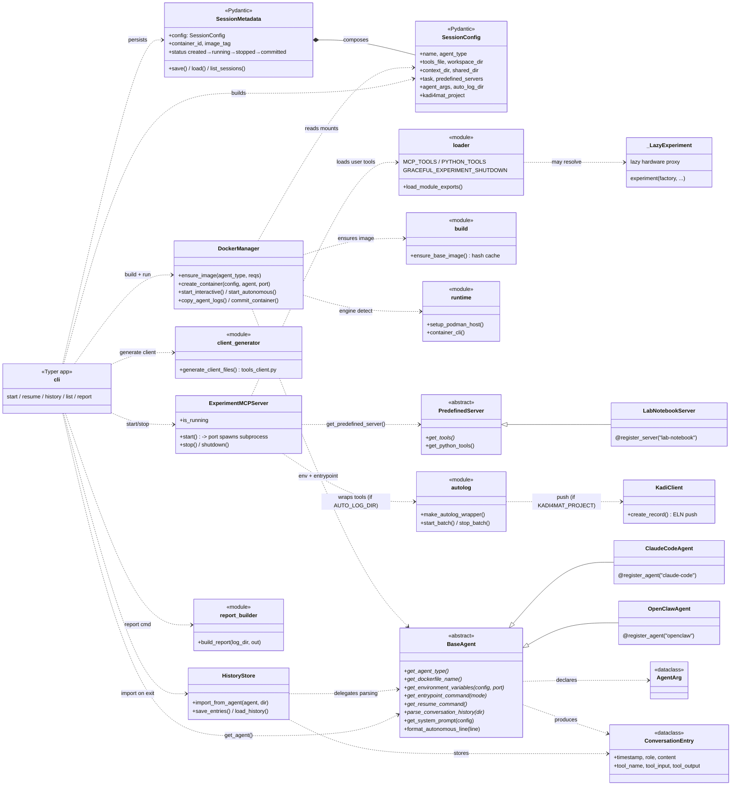
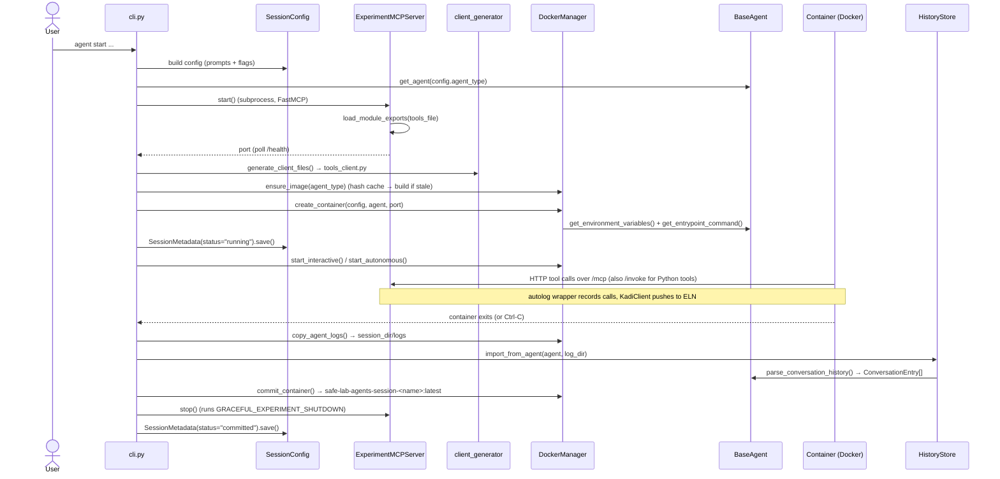

# `safe_lab_agents` — Architecture Overview

## What it is

`safe_lab_agents` lets a scientist hand a lab experiment to an AI agent that runs **sandboxed in
Docker**. The agent never touches the host directly — it calls **user-defined MCP tools** that the
package serves over HTTP from the host, and those tools drive the real lab hardware. Two
properties define the system:

- **Docker provides isolation.** The agent and its tooling run in a container with three bind
  mounts: `/agent/workspace` (read-write), `/agent/context` (read-only), `/agent/shared`
  (read-write). On stop, the container is committed to an image so the session is **resumable**.
- **MCP provides the controlled interface.** A `FastMCP` server runs in a host subprocess. It
  imports the user's plain-Python tools file at runtime and exposes each public function as an MCP
  tool (for the agent to call) or as a Python-callable tool (invoked from inside the container via
  a generated HTTP client). Tool calls can be auto-logged to JSON/HDF5 and pushed to a
  [Kadi4Mat](https://kadi.iam.kit.edu) ELN.

Every run's native agent log is parsed into a standard `ConversationEntry` history. The CLI ties
it all together: collect config → start MCP → build image → run container → on exit, capture logs,
import history, and commit the image.

## Subsystem map

| Package | Responsibility |
|---|---|
| `cli.py` | Typer app; entry point. Orchestrates `start` / `resume` / `history` / `list` / `report` / `export-eln`. |
| `start_config.py` | Loads the optional YAML config file (`safe-lab-agents.config.yaml`) that supplies defaults for `start`; precedence is explicit CLI flag > config value > wizard/default. |
| `config.py` | `SessionConfig` (validated user choices) and `SessionMetadata` (persisted state + status). |
| `agents/` | Agent-backend plugin system: `BaseAgent` interface + `claude-code` / `openclaw` backends, registered by name. |
| `mcp/` | MCP server subprocess, runtime tool loading, the in-container Python client generator, and predefined servers. |
| `docker/` | Container lifecycle: image build + hash caching, create/start/stop/commit, Docker/Podman runtime detection. |
| `history/` | Parse agent-native logs into `ConversationEntry`; persist `history.json`. |
| `report/` | Build a self-contained HTML report from auto-log output. |
| `export/` | Package an auto-log folder as a standard `.eln` (RO-Crate) file for import into other ELNs (`build_eln`). |
| `mcp/predefined/records.py` | Format-neutral record serialization shared by autolog / Kadi / `.eln`: `json_safe`, the `quantity` unit convention, and the canonical HDF5 array extractor. |

## Class-interaction diagram

**Edge legend:** solid triangle `<|--` = inheritance; solid diamond `*--` = composition;
dashed `..>` = "uses / calls". Three registries decouple the wiring: `AGENT_REGISTRY`
(`@register_agent`) and `PREDEFINED_SERVERS` (`@register_server`) map names → classes, and the
user's tools file declares `MCP_TOOLS` / `PYTHON_TOOLS` / `GRACEFUL_EXPERIMENT_SHUTDOWN`.

## Session lifecycle (`start`)

`resume` follows the same path but loads the existing `SessionMetadata`, restores the committed
session image, and uses `BaseAgent.get_resume_command()` instead of the fresh entrypoint.

## Class reference

| Class | File | Base | Key members |
|---|---|---|---|
| `SessionConfig` | `config.py` | Pydantic `BaseModel` | `name`, `agent_type`, `tools_file`, `workspace_dir`, `context_dir`, `shared_dir`, `task`, `predefined_servers`, `agent_args`, `auto_log_dir`, `kadi4mat_project` |
| `SessionMetadata` | `config.py` | Pydantic `BaseModel` | composes `config`; `container_id`, `image_tag`, `status`; `save()`, `load()`, `list_sessions()` |
| `BaseAgent` | `agents/base.py` | `ABC` | abstract: `get_agent_type`, `get_dockerfile_name`, `get_environment_variables`, `get_entrypoint_command`, `get_resume_command`, `parse_conversation_history`; concrete: `get_system_prompt`, `get_agent_args`, `format_autonomous_line` |
| `ClaudeCodeAgent` | `agents/claude_code.py` | `BaseAgent` | parses `~/.claude/projects/**/*.jsonl`; renders `stream-json`; OAuth/login handling |
| `OpenClawAgent` | `agents/openclaw.py` | `BaseAgent` | parses `~/.openclaw/agents/**`; provider/api-key/model args |
| `AgentArg` | `agents/base.py` | dataclass | descriptor for an agent CLI flag |
| `ConversationEntry` | `agents/base.py` | dataclass | `timestamp`, `role`, `content`, `tool_name`, `tool_input`, `tool_output`, `metadata` |
| `DockerManager` | `docker/manager.py` | — | `ensure_image`, `create_container`, `start_interactive`, `start_autonomous`, `copy_agent_logs`, `commit_container`, `engine_is_podman` |
| `ExperimentMCPServer` | `mcp/server.py` | — | `start() -> port`, `stop()`, `shutdown()`, `is_running`; subprocess runs `_run_server` (FastMCP, `/health`, `/invoke`) |
| `PredefinedServer` | `mcp/predefined/__init__.py` | `ABC` | `get_tools()`, `get_python_tools()` |
| `LabNotebookServer` | `mcp/predefined/lab_notebook.py` | `PredefinedServer` | `add_entry`, `search_entries`, `list_entries` |
| `KadiClient` | `mcp/predefined/kadi4mat.py` | — | `create_record()`; rate-limited ELN push, invoked by the autolog wrapper |
| `_LazyExperiment` | `mcp/tool_utils.py` | — | `experiment(factory, …)` — defers hardware construction to first use |
| `HistoryStore` | `history/store.py` | — | `import_from_agent`, `save_entries`, `load_history`, `append_entry` |

Module-level orchestration: `docker/build.py` (`ensure_base_image`, SHA-256 hash cache),
`docker/runtime.py` (`setup_podman_host`, `container_cli`), `mcp/loader.py`
(`load_module_exports`), `mcp/client_generator.py` (`generate_client_files`),
`report/builder.py` (`build_report`), `export/eln.py` (`build_eln` — maps auto-log
records to an RO-Crate `.eln`), `mcp/predefined/records.py` (`json_safe`, `quantity`,
`extract_arrays`).

## Extension points

- **Add an agent backend.** Implement `BaseAgent` in `agents/my_agent.py`, decorate with
  `@register_agent("my-agent")`, add `Dockerfile.my-agent` + `entrypoint.my-agent.sh` under
  `docker/dockerfiles/`. Auto-imported via `agents/__init__.py`. (See `CLAUDE.md` → *Adding a New
  Agent*.)
- **Add a predefined MCP server.** Subclass `PredefinedServer` in `mcp/predefined/my_server.py`,
  decorate `@register_server("my-server")`. Auto-imported via `mcp/predefined/__init__.py`.
- **Tools file conventions.** Functions listed in `MCP_TOOLS` become agent-callable MCP tools;
  those in `PYTHON_TOOLS` are exposed via the generated `tools_client.py` inside the container.
  Wrap stateful hardware with `experiment(factory, …)` so it's constructed lazily (the tools file
  is imported in several processes). A module-level `GRACEFUL_EXPERIMENT_SHUTDOWN` callable runs
  cleanup inside the MCP subprocess on reload and shutdown. (See `CLAUDE.md` → *MCP Tool
  Loading*.)
